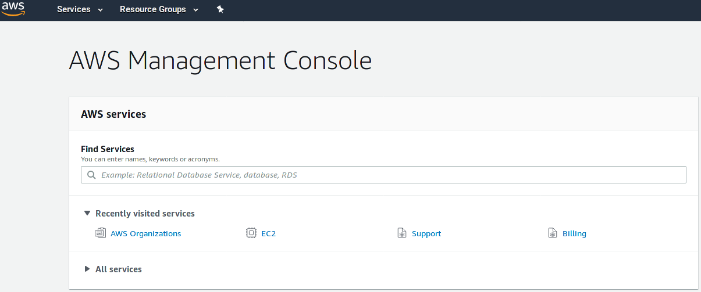
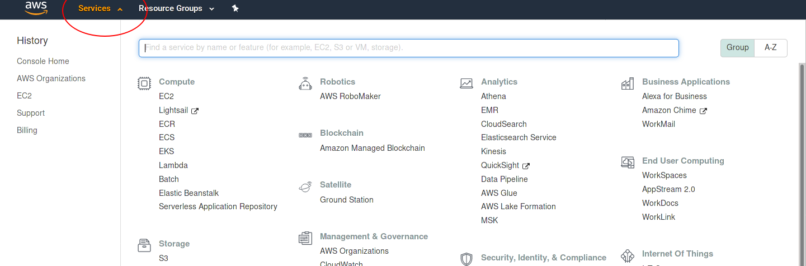
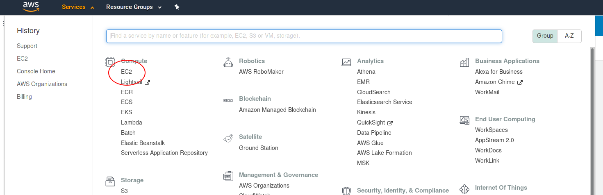
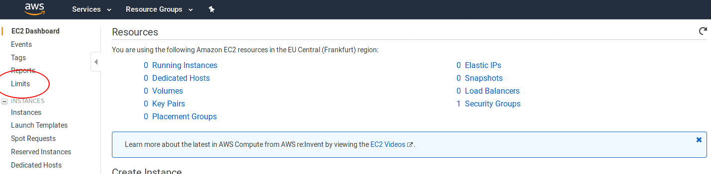
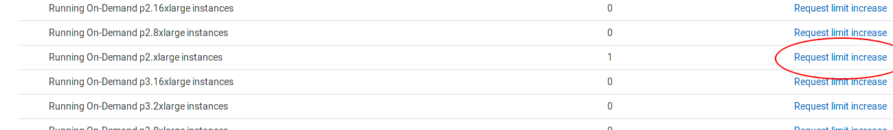
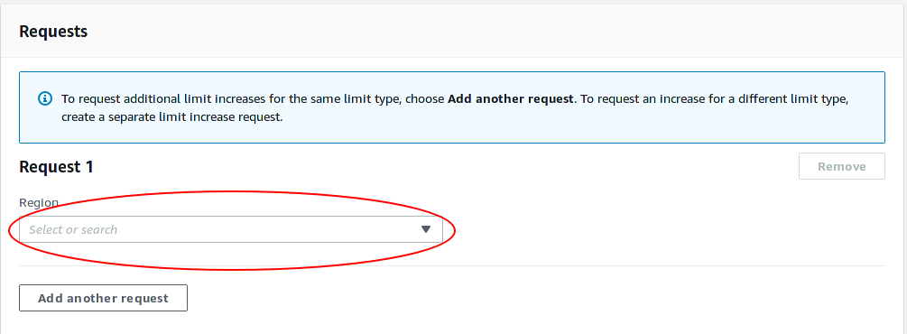
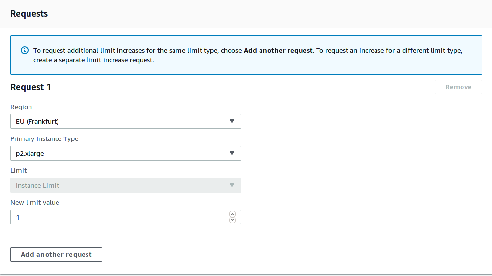

# AWS Sagemaker Notebooks

**IMPORTANT** One organizer had to provide his credit card details to AWS in order to accept the free credits by AWS! So please, always shut down notebook instances once you leave the workshop. If you don't, we will do it regardless of the state, your notebook is in and you might loose some important results. 

## Getting an account

If you need an AWS account, contact the workshop organizers. We can create accounts without the need to provide credit card credentials. You will get a message saying something along the lines of:

``` text
Welcome to Amazon Web Services

For the next 12 months, you'll have free access to core AWS compute, storage, 
database, and application services within the limits of the Free Tier.
```

Go to [aws console page](aws.amazon.com/console/) and try to sign in. When you have provided your email address (which was used to create an accound for you), click `Forgot Password?`. This way, you can set a new password of your liking.

**IMPORTANT**: Due to budget reasons, your accounts will be removed 5 days after the workshop.


## Raise the GPU node limit to 1

By default and as a safety measure, you are not allowed to request a GPU node on the AWS cloud. This limit can be changed on an per-account basis. This section documents how.

1. Log into the [aws console page](aws.amazon.com/console/).  
   You should see something like this:  
   

2. Click on services  


3. Click on EC2  


4. Click on Limits in the lefthand pane.  


5. Scroll down until you find the desired node configuration  


6. Click `Request limit increase`

7. Inside the Limit Request page, choose the Region `EU (Frankfurt)`  


8. Fill in `p2.xlarge` as primary instance type, and `1` as "New limit value"  


9. Scroll down and add something to the notes like `GPU nodes required for Deep Learning Training at the 2019 Dresden Deep Learning Hackathon`

10. Click `Submit` at the very bottom of the page.


## References

- AWS [EC2 pricing](https://aws.amazon.com/ec2/pricing/on-demand/)

[[back to root page]](../../README.md)
